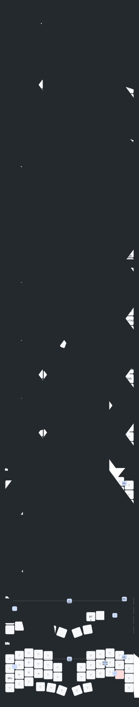

# zmk-config-roBa

260307にビルド失敗。そのため複数個所のリセットを実行。

1. 「言葉が通じない」ドライバの混入
最初にビルドが通らなかった最大の原因は、「ドライバ（PMW3610）」の種類が、設定ファイル（keymap）で使っている言葉と一致していなかったことです。

以前の失敗状態： badjeff 版ドライバを読み込んでいた。このドライバは automouse-layer という設定項目を知らない（target-layers という名前しか受け付けない）。

あなたの設定： automouse-layer を使っていた。

結果： ZMKが「そんな設定項目は知らない！」とエラーを出しました。

2. 重複とキャッシュの罠
途中で target-layers がないと言っていたのにエラーが出続けたのは、ファイル内に同じコードが**2回繰り返して記述されていた（重複）**ことが原因です。

前半を直しても、後半部分に古い設定（evt-type など）が残っていたため、ビルドサーバーはそこを読み込んで「まだエラーがある」と判定していました。

結論：なぜ動いたか？
以下の3つの条件がすべて揃ったからです。

ドライバを戻した： west.yml を kumamuk-git 版に戻したことで、automouse-layer という言葉が再び通じるようになった。

重複を消した： ファイル末尾の余計なコードを削除し、純粋なハードウェア定義だけにした。

記述を最小限にした： ドライバ側で自動処理される evt-type などを消したことで、設定の衝突がなくなった。

